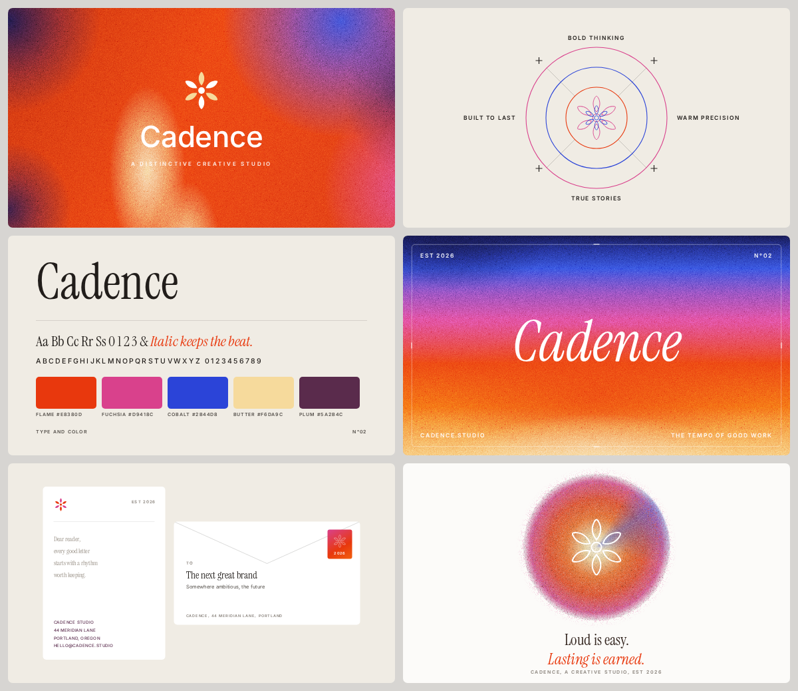

# Brand Boards

Six tile brand identity boards for invented creative studios, generated
purely in code. No stock assets, no AI images, no external resources
except Google Fonts (embedded as woff2 data URIs, so each page renders
fully offline). All boards share one visual language (airbrushed grainy
gradients, Instrument Serif plus tracked Inter micro labels, thin
geometry) but no board repeats another board's elements.

## Board 1: Sonder (`index.html`)

Horizontal hero lockup, overlapping circles values diagram with sparkles
and registration squares, four card cluster, inset thirds grid banner,
2x2 business cards with stipple fill backs, halo ring closer.


## Board 2: Cadence (`cadence.html`)

Stacked hero lockup, concentric rings values diagram with plus glyphs,
type and color specimen, full bleed typographic banner with hairline
frame, letterhead and envelope stationery, glowing sun orb closer.
Logomark is a six petal hexafoil around a circle core, rendered as
duotone, echo (nested outlines), and bold outline variants.



## Files

- `index.html`, `cadence.html` self contained boards, 2400 x 2076 px
- `export.cjs` headless export script (Playwright plus system Chromium)
- `brand-board.png`, `cadence.png` final exports, 4800 px wide

## Rendering

```bash
node export.cjs                        # Sonder, brand-board.png at 4800 px
node export.cjs --preview              # Sonder, preview.png at 1200 px
node export.cjs cadence.html           # Cadence, cadence.png at 4800 px
node export.cjs cadence.html --preview # Cadence, cadence-preview.png
```

The script waits for `window.__ready`, which the page sets once fonts are
loaded and all stipple logos are generated.

## Design spec

- Palette: electric orange `#F4520C`, scarlet `#E02B16`, magenta `#E0518F`,
  ultramarine `#3239C9`, deep navy `#12124E`, cream `#F5D8A3`,
  violet `#7A4FD0`, maroon `#6E3742`, warm off white `#EFEBE4`,
  board gray `#D7D5D2`, card black `#181818`, ink `#211D1A`
- Type: Instrument Serif (statements, quotes, taglines) and Inter
  (all uppercase micro labels with wide tracking)
- Grid: 24 px outer margin and gutters, six 1164 x 660 tiles, radius 14
- Logomark: pinwheel rosette, eight comma shaped petals in rotational
  symmetry around a square core, defined once as path data and rendered
  in five variants (solid, outline, multicolor stroke, stipple fill,
  stipple outline)
- Film grain: layered SVG feTurbulence noise tiles blended with overlay
  and soft light on every gradient surface
- Stipple: seeded jittered grid sampling with `isPointInFill` for fills
  and `getPointAtLength` walks for outlines, so every render is identical
