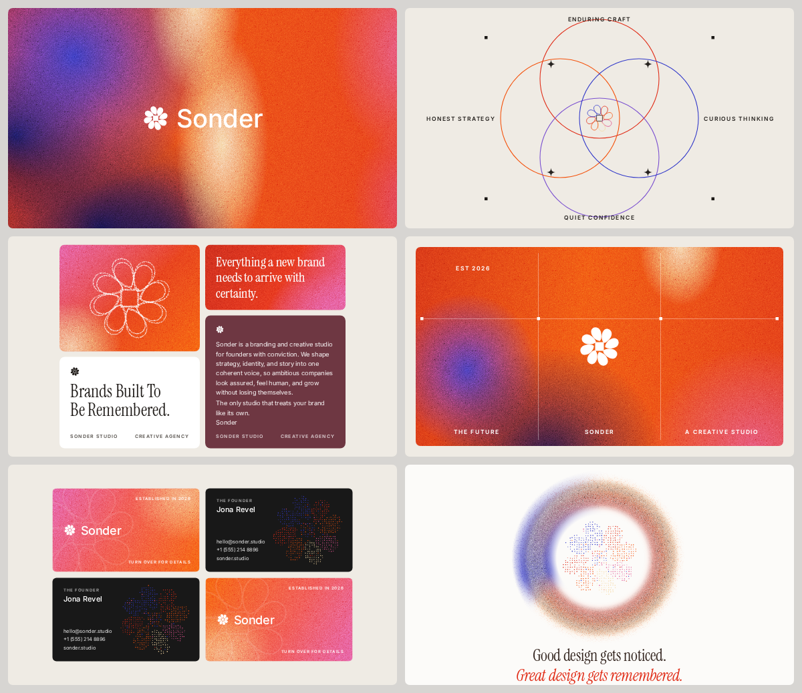

# Sonder Brand Board

A six tile brand identity board for Sonder, an invented creative studio,
generated purely in code. No stock assets, no AI images, no external
resources except Google Fonts (embedded as woff2 data URIs, so the page
renders fully offline).



## Files

- `index.html` self contained board, renders at 2400 x 2076 px
- `export.cjs` headless export script (Playwright plus system Chromium)
- `brand-board.png` final export, 4800 px wide

## Rendering

```bash
node export.cjs            # writes brand-board.png at 4800 x 4152
node export.cjs --preview  # writes preview.png at 1200 px wide
```

The script waits for `window.__ready`, which the page sets once fonts are
loaded and all stipple logos are generated.

## Design spec

- Palette: electric orange `#F4520C`, scarlet `#E02B16`, magenta `#E0518F`,
  ultramarine `#3239C9`, deep navy `#12124E`, cream `#F5D8A3`,
  violet `#7A4FD0`, maroon `#6E3742`, warm off white `#EFEBE4`,
  board gray `#D7D5D2`, card black `#181818`, ink `#211D1A`
- Type: Instrument Serif (statements, quotes, taglines) and Inter
  (all uppercase micro labels with wide tracking)
- Grid: 24 px outer margin and gutters, six 1164 x 660 tiles, radius 14
- Logomark: pinwheel rosette, eight comma shaped petals in rotational
  symmetry around a square core, defined once as path data and rendered
  in five variants (solid, outline, multicolor stroke, stipple fill,
  stipple outline)
- Film grain: layered SVG feTurbulence noise tiles blended with overlay
  and soft light on every gradient surface
- Stipple: seeded jittered grid sampling with `isPointInFill` for fills
  and `getPointAtLength` walks for outlines, so every render is identical
