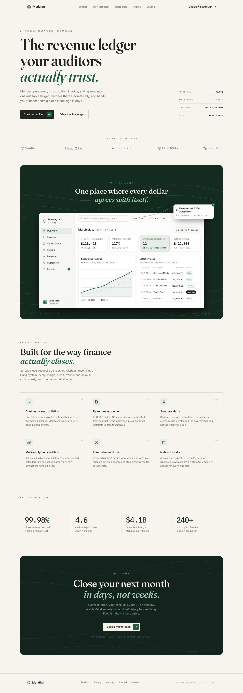

# Meridian landing page

A complete landing page for Meridian, an invented SaaS product: a revenue
reconciliation platform for subscription finance teams. Built purely in
HTML, CSS, and SVG at the craft level of a set of reference landing pages,
committing to one coherent art direction rather than copying any of them.



## Design spec

- **Direction**: warm editorial paper. Serif display voice, quiet
  navigation, a fully coded dashboard as the centerpiece, one accent color
  used sparingly.
- **Palette**: paper `#F7F4EE`, ink `#20241F`, muted `#6F6B60`, hairline
  `#E4DFD3`, accent spruce `#1E5C43`, tint `#E4EEE7`, showcase field
  `#13251C`.
- **Type**: Fraunces 500/600 plus italic for display, Inter 400/500/600
  for UI, IBM Plex Mono 400/500 for micro labels and numerals. All Google
  Fonts, embedded as woff2 data URIs so the page renders fully offline.
- **Spacing**: 8 px base scale, 1200 px container, 130 px section rhythm
  on desktop.
- **Showcase frame**: the dashboard floats on a deep spruce field etched
  with SVG topographic contour lines and film grain, with square corner
  ticks, mono coordinate labels (the prime meridian, naturally), a curved
  hairline connector, and a floating auto-match toast with a notification
  badge.

## Files

- `index.html` self contained page (CSS, JS, and fonts inline),
  responsive from 375 px to 1440 px
- `export.cjs` headless export script (Playwright plus system Chromium)
- `desktop.png` full page at 2880 px wide, `mobile.png` at 750 px wide

## Rendering

```bash
node export.cjs            # desktop.png (2880 px) and mobile.png (750 px)
node export.cjs --preview  # half resolution *-preview.png versions
```

The script waits for `window.__ready` (set once fonts load) and adds a
`no-anim` class so scroll-reveal states are frozen in the capture.
